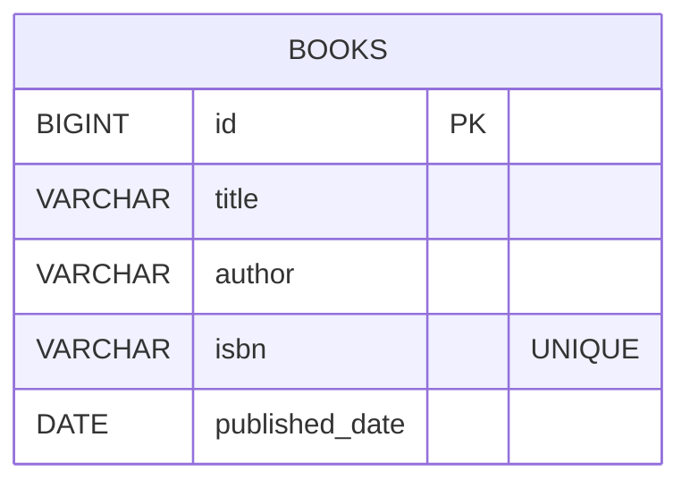

# 📚 Book Management Microservice

Simple Book Management Microservice built using **Java Spring Boot**.  

## 🧩 Tech Stack

- Java 21
- Spring Boot
- Maven
- PostgreSQL
- JPA (Hibernate) with DAO pattern
- Flyway (Database Migration)
- Swagger / OpenAPI (springdoc)
- Postman (for API testing)

---

## 🗄️ Database

### Database Name
`bookdb`

### Table: `books`

| Column          | Type        | Notes                   |
|----------------|-------------|-------------------------|
| id             | BIGSERIAL   | Primary Key             |
| title          | VARCHAR     | Not null                |
| author         | VARCHAR     | Not null                |
| isbn           | VARCHAR     | Not null, unique        |
| published_date | DATE        | Nullable                |

## 🧾 ER Diagram



## ▶️ How to Run the application

1) **Make sure PostgreSQL is running locally**

   Ensure PostgreSQL service is active on your machine.

2) **Create database**

   Connect to PostgreSQL and create the database:

   ```sql
   CREATE DATABASE bookdb;
   ```
   
3) **Configure database credentials**

   Update application.properties with your local database configuration:
   ```
    spring.datasource.url=jdbc:postgresql://localhost:5432/bookdb
    spring.datasource.username=YOUR_DB_USERNAME
    spring.datasource.password=YOUR_DB_PASSWORD
   ```
4) **Flyway Configuration**

   This project uses Flyway, the migration file is located at:
   ```css
   src/main/resources/db/migration/
   ```
5) **Verify database tables if exist**
   ```commandline
    \dt
   ```
   expected table are like this:
   - books 
   - flyway_schema_history

6) **Run the application**
   ```commandline
   mvn clean spring-boot:run
   ```
7) **Verify application is running by accessing the swagger**
   ```
   http://localhost:8080/swagger-ui.html
   ```
